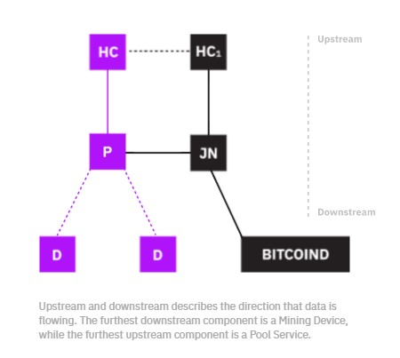

# Stratum
The stratum overlay protocol was extended to support pooled mining as a replacement for
obsolete **getwork protocol** in late 2012. The mining service specification was initially announced
via Slush's pool's website [2]. 

# Why Stratum? [4]
The main reason why I designed this protocol and implemented opensource pool server is that **the current getwork&LP mining protocol has many flaws and it can hardly be used in any large-scale setup.** 
 
ASIC miners are probably coming at the end of the year 2012 :q, so Bitcoin community definitely needs some solution, which will easily scale to tera-hashes per second per pool user.

# Protocol Summary [1]
The Stratum protocol reduces client-server communications to levels that are usable with very low
bandwidth, and reduces the strain on servers drastically.
 
**The key concept behind Stratum based mining is "push" based work**, where the server pushes
work to the miner, and the miner is able to utilize that work until the next push, regardless of the
hash rate.
 
**This is done by allowing the miner to increase a counter in the coinbase transaction, and build a
new merkleroot for the block header, which effectively means the miner generates new work continuously without contacting the server.**

# HTTP: Communication is Driven by Miners [4]
HTTP was designed for web site browsing where clients ask servers for specific content. **Pooled mining is different - server knows very well what clients need and can control the communication in a more efficient way.** 

# The Bitcoin Network [5]

Bitcoin’s P2P network architecture is much more than a topology choice. The term “bitcoin network” refers to the collection of nodes running the bitcoin P2P
protocol. In addition to the bitcoin P2P protocol, there are **other protocols such as
Stratum** that are used for mining and lightweight or mobile wallets. <strong>These additional protocols are provided by gateway routing servers that access the bitcoin network
using the bitcoin P2P protocol and then extend that network to nodes running other
protocols.</strong> For example, **Stratum servers connect Stratum mining nodes via the Stratum protocol to the main bitcoin network and bridge the Stratum protocol to the bit‐
coin P2P protocol.** We use the term **“extended bitcoin network”** to refer to the overall
network that includes the bitcoin P2P protocol, pool-mining protocols, the Stratum
protocol, and any other related protocols connecting the components of the bitcoin
system.

Although nodes in the bitcoin P2P network are equal, they may take on different
roles depending on the functionality they are supporting. A bitcoin node is a collec‐
tion of functions: routing, the blockchain database, mining, and wallet services.

The main bitcoin network, running the bitcoin P2P protocol, consists of between
5,000 and 8,000 listening nodes running various versions of the bitcoin reference cli‐
ent (Bitcoin Core) and a few hundred nodes running various other implementations
of the bitcoin P2P protocol, such as Bitcoin Classic, Bitcoin Unlimited, BitcoinJ, Lib‐
bitcoin, btcd, and bcoin. A small percentage of the nodes on the bitcoin P2P network
are also mining nodes, competing in the mining process, validating transactions, and
creating new blocks. Various large companies interface with the bitcoin network by
running full-node clients based on the Bitcoin Core client, with full copies of the
blockchain and a network node, but without mining or wallet functions. These nodes
act as network edge routers, allowing various other services (exchanges, wallets, block
explorers, merchant payment processing) to be built on top.

Attached to the main bitcoin P2P network are a number of pool servers and protocol gateways that connect nodes running other protocols. These other protocol nodes are mostly pool
mining nodes and lightweight wallet clients, which do not carry a full copy of the blockchain.
 

.png)

All nodes include the routing function to participate in the network and might
include other functionality.
# How is getwork? [4]
Strictly following getwork specification, one getwork job is enough for 4.2GHash/s mining rig and (thanks to ntime rolling) this job is usable for one minute or until a new Bitcoin block arrives (depending on what happens first).
 
So, **for 42 GHash/s rig you’ll need 10 getwork requests at once, but usually a few more because of some pre-caching strategies implemented by miners to prevent idling on network latencies.** 
 
And what about 1 THash/s ASIC miners coming soon? We simply need some solution where network load is not at all bounded to miners performance.

# Long Polling: An Anti-Pattern [4]
When pools came into the game, people found out that they must decide between short polling intervals (=higher network load, lower stale ratio) and intervals, which don't overload network and servers, but lead to a much higher ratio of rejected shares, and **long polling pattern was the answer.** 
 
Long polling is a great way to achieve real-time updates using standard web technologies. But as I already mentioned in the text above, web technologies are not ideal for Bitcoin mining. 
Long polling uses separate connection to pool server, which leads to various issues on server side, like load balancing of connections between more backends.
 
 
**Another problem consists of packet storms, coming from clients trying to reconnect to the server after long polling broadcasts. Sometimes it's hard to distinguish valid long polling reconnections from DDoS attacks.** All this makes pool architecture more complicated and harder to maintain, which is reflected in less reliable pool service and has a real impact on miners.

# What's Stratum Protocol use case? [4]
I originally designed Stratum protocol for lightweight Bitcoin client called Electrum.
 

## Stratum by simpilified manner
In a simplified manner, Stratum is a line-based protocol using plain TCP socket, with payload encoded as JSON-RPC messages. That's all. Client simply opens TCP socket and writes requests to the server in the form of JSON messages finished by the newline character \n. Every line received by the client is again a valid JSON-RPC fragment containing the response.

## It's very easy to implement and very easy to debug!
There are good reasons for such solution: it is very easy to implement and very easy to debug, because both sides are talking in human-readable format.
 
The protocol is unlike many other solutions easily extensible **without messing up the backwards compatibility.**
 

As a bonus, JSON is widely supported on all platforms and current miners already have JSON libraries included. So packing and unpacking of the message is really simple and convenient.
 

## There is no HTTP overhead
There's no HTTP overhead involved and there're no hacks like mining extension flags encoded in HTTP headers anymore.
 

But the biggest improvement from HTTP-based getwork is the fact, that server can drive the load by itself, it can send broadcast messages to miners at any time without any long-polling workarounds, load balancing issues and packet storms.

# Extranonce Rolling: The New Dimension [4]
This is probably the most innovative part of the new protocol. In contrary to current mining where only *ntime* and *nonce* can be iterated, **Stratum mining protocol gives a power to miners to easily build unique coinbase transactions locally, so they'll be able to produce unique block headers locally.**
 

I recommend to iterate four bytes of extranonce, which gives the possibility to serve 18 EHash/s (Exa-hashes/s) mining rig from a single TCP connection. But it can be easily changed by the pool operator anytime.

# Building Local Work [2]

The mining pool provides a miner with two pieces of information upon connecting. The first is
ExtraNonce1. The second piece of information is ExtraNonce2_size. This is how many bytes should
be used for the ExtraNonce2 counter. ExtraNonce2 is a binary counter, and should be padded to fill
up the number of bytes identified as the ExtraNonce2_size.
When the pool pushes work, it provides the coinbase transaction in two pieces (coinbase1 and
coinbase2) and a list of tree node hashes. When the miner is building the block header to hash, it
builds a merkleroot by creating a new coinbase transaction and using the right tree node hashes
provided by the pool. The full coinbase is built by combining: Coinbase1 + ExtraNonce1 +
ExtraNonce2 (padded) + Coinbase2.
This transaction is then passed through a double SHA256 to get the coinbase tx hash. The miner
soft then combines that with first merkle node hash provided by the work (if any), and double
SHA256 the combined binary string. Then it takes that result, and does the same with the next
merkle node hash, repeating this process until all merkle node hashes have been combined with
previous results.
This process creates a unique merkle root for the new block header, which can then be pushed
through the miner using the standard 32-bit nonce counter.

Typical stratum mining workflow:

Example of stratum communication between a mining pool and client
:

# Technical Explanation [4]
Block header (that string what is in getwork response and what miners are hashing) is composed from following parts:
<li>
Block version, nbits, hash of previous block in the blockchain and some padding bytes, which are constants.
</li>
<li>Nonce and ntime, which miner can modify already.</li>
<li>Merkle root hash, which is created by hashing of bitcoin transactions included in the particular mining job.</li>

 

## Produce More Unique Block Headers 
To produce more unique block headers (and thus be able to generate more unique hashes), we have to modify something.
 

Every bitcoin block contains so-called coinbase transaction which specify the bitcoin address for sending block reward.
 
Fortunately there's a chance to modify this transaction without breaking anything. **By changing coinbase transaction, merkle root will change and we will have unique block header to hash. Currently this (creating unique coinbase) happens on pool servers. So let's move it to miners!**
 

## JSON Versus Your-Preferred-Protocol
I considered many solutions for serializing and deserializing message payloads. I wrote some reasons for JSON above, but let's sumarize them again:

<li>JSON payload is human readable, easy to implement and debug.</li>
<li>All bitcoin miners already have JSON libraries included. JSON has native support in almost every language.</li>
<li>In contrary of most binary protocol, JSON payload can be easily extended without breaking backward compatibility.</li>
<li>JSON-RPC already specifies three native message types which Stratum uses: request, response and notification. We don't need to reinvent a wheel.</li>
<li>JSON has definitely some data overhead, but Stratum mining messages typically fits into one TCP packet...</li>
 

## Stratum Versus Getblocktemplate
Getblocktemplate introduced in bitcoind 0.7 is a very progressive solution for delegating block creation from full bitcoin client to standalone, specialized software.
 
Stratum mining server uses getblocktemplate mechanism under the hood. There are still some reasons why Stratum is, in my opinion, a better solution for pooled mining:

<li>It is less complex, much easier to implement in existing miners and it still does the job perfectly.</li>

<li>For historical reasons getblocktemplate still uses HTTP protocol and long polling mechanism. I described above why this fails on large scale mining.</li>

<li>Stratum scales much better for rising amount of processed Bitcoin transactions, because it transfers only merkle branch hashes, in the contrary to complete dump of server’s memory pool in getblocktemplate.</li>

# Stratum V2 [6]
The next generation protocol for pooled mining by Pavel Moravec and Jan Čapek, in collaboration with Matt Corallo and other industry experts.
## Stratum V2 Focuses
Stratum V2 is the next generation protocol for pooled mining. **It focuses on making data transfers more efficient, reducing physical infrastructure requirements for mining operations, and increasing security.**
 

Stratum V2 introduces three new sub-protocols that allow miners to select their own transaction sets through a negotiation process with pools, improving decentralization.

## Protocol Overview

* <b>Device</b>  
The actual mining machine computing the hashes.

* <b>Proxy</b>  
An intermediary between Mining Devices and Pool Services that aggregates connections for efficiency and may optionally provide additional functionality, such as monitoring the health and performance of devices.

* <b>Hashrate Consumer</b> 
An upstream node to which shares (i.e. completed jobs) are being submitted. The most common hashrate consumers are pools.

* <b>Job Negotiator</b> 
A node which negotiates with a pool on behalf of one or more miners to determine which jobs they will work on. This node also communicates with a block template provider (e.g. bitcoind) and sends jobs to mining proxies to be distributed to miners.
 

# For Mining Software Developers [4]
## Exception Handling
Stratum defines simple exception handling. Example of rejected share looks like:
 
 <code>{"id": 10, "result": null, "error": (21, "Job not found", null)}</code>

Where error field is defined as (error_code, human_readable_message, traceback).
Traceback may contain additional information for debugging errors.
Proposed error codes for mining service are:
 
20 - Other/Unknown 
21 - Job not found (=stale) 
22 - Duplicate share 
23 - Low difficulty share 
24 - Unauthorized worker 
25 - Not subscribed 

## Miner Connects the Server
On the beginning of the session, client subscribes current connection for receiving mining jobs:
 
<code>
{"id": 1, "method": "mining.subscribe", "params": []}</code>
 
<code>{"id": 1, "result": [ [ ["mining.set_difficulty", "b4b6693b72a50c7116db18d6497cac52"], ["mining.notify", "ae6812eb4cd7735a302a8a9dd95cf71f"]], "08000002", 4], "error": null}
</code>
 

The result contains three items: 
**1- Subscriptions details** - 2-tuple with name of subscribed notification and subscription ID. Teoretically it may be used for unsubscribing, but obviously miners won't use it. 
**2- Extranonce1** - Hex-encoded, per-connection unique string which will be used for coinbase serialization later. Keep it safe!  
**3- Extranonce2_size** - Represents expected length of extranonce2 which will be generated by the miner. 

## Authorize Workers
Now let authorize some workers. You can authorize as many workers as you wish and at any time during the session. In this way, you can handle big basement of independent mining rigs just by one Stratum connection. 
<code>{"params": ["slush.miner1", "password"], "id": 2, "method": "mining.authorize"}\n
{"error": null, "id": 2, "result": true}\n</code>
 

## Server Start Sending Notifications With Mining Jobs
Server sends one job *almost* instantly after the subscription.

Small engineering note: There's a good reason why first job is not included directly in subscription response - miner will need to handle one response type in two different way; firstly as a subscription response and then as a standalone notification. Hook job processing just to JSON-RPC notification sounds a bit better to me.

# Low-Level Communication protocol [2]

Protocol itself is the way how to exchange information between client and server, using already
established transport. Protocol doesn’t understand the meaning of exchanged information, it only
keeps the track on request-response and internal data format. Basic structure of the Stratum
protocol is line-based, json-encoded message. Every message is on separate line and there exists
only two formats of messages - request and response. Those messages use the format of JSON-RPC
2.0 protocol (http://json-rpc.org/wiki/specification).
JSON-RPC allows two types of requests. One is part of standard RPC mechanism when every
request expects some response. Second type is the notification formatted as a JSON-RPC request,
but it doesn’t expect any kind of response. Typical example is broadcasting of new work unit to
clients. The difference between RPC request and notification is that notification always has id=null.

1. Request:
    Every RPC request contains three parts:
    * message ID - integer or string
    * remote method - unicode string
    * parameters - list of parameters
    
    Message ID must be an unique identifier of request during current transport session. It may be integer or some unique string, like UUID. ID must be unique only from one side (it means, both server and clients can initiate request with id “1”). Client or server can choose string/UUID identifier for example in the case when standard “atomic” counter isn’t available (multi-processing environment like PHP servers).
    
    Examples:
    * Authorizing a worker:
        * Client: {"params": ["eleuthria_miner1", "password"], "id": 2, "method": "mining.authorize"}\n
        * Server: {"error": null, "id": 2, "result": true}\n
    * Subscribe for receiving information about new work units (client->server):
        * Client: {"id": 1, "method": "mining.subscribe", "params": []}\n

2. Notification:
It is like Request, but it does not expect any response and message ID is always null:
    * message ID - null
    * remote method - unicode string
    * parameters - list of parameters

    Examples:
    * Broadcast message about new work unit (server->client). Server don’t expect any
    response to this message. Client must perform call “mining.subscribe” to start receiving
    requests like this:
    * Server: {"params": ["bf", "4d16b6…000000","01000000…...4e5008", "072f736…000000",
    ["c5bd77249....bfdb19c0e5","049b4e78e…3fd2f12"],
    "00000002", "1c2ac4af", "504e86b9", false], "id": null, "method": "mining.notify"}\n

3. Response: Every response contains following parts
    * message ID - same ID as in request, for pairing request-response together
    * result - any json-encoded result object (number, string, list, array, …)
    * error - null or list (error code, error message)

# Methods
##  Methods (client to server)
1. mining.authorize("workername", "password")

    The result from an authorize request is usually true (successful), or false. The password may be
    omitted if the server does not require passwords. One a worker has been authorized, the client can
    submit shares using mining.submit, using the authorized workername.

2.  mining.capabilities({"notify":[], "set_difficulty":{}, "set_goal":{}, "suggested_target": "hex target"}):

    **NOTE: This is a draft extension proposal. It is not yet in use, and may change at any moment.**

    The client may send this to inform the server of its capabilities and options. The singleton
    parameter is an Object describing capabilities; by default, it is considered as {"notify":{},
    "set_difficulty":[]}, but as soon as this method is used these must be explicitly included if desired.
    The "suggested_target" key may supersede the mining.suggest_target method.
    Note that most of the keys do not have any meaningful value at this time, and the values thereof
    should be ignored (ie, only their presence matters).

3. mining.extranonce.subscribe():

    Indicates to the server that the client supports the mining.set_extranonce method.

4. mining.get_transactions("job id"):
    Server should send back an array with a hexdump of each transaction in the block specified for the given job id.

5. mining.submit("workername", "job id", "ExtraNonce2", "nTime", "nOnce"):

    Miners submit shares using the method "mining.submit". Client submissions contain:
    1. Worker Name.
    2. Job ID.
    3. ExtraNonce2.
    4. nTime.
    5. nOnce.

    Server response is resul bt: true for accepted, false for rejected (or you may get an error with more
    details). Note that the ExtraNonce1 is not included: this value is already known to the server,
    because each client has an associated ExtraNonce1 value.

6. mining.subscribe("user agent/version", "extranonce1"):

    The optional second parameter specifies a mining.notify subscription id the client wishes to
    resume working with (possibly due to a dropped connection). If provided, a server MAY (at its
    option) issue the connection the same extranonce1. Note that the extranonce1 may be the same
    (allowing a resumed connection) even if the subscription id is changed!

    The client receives a result:

    [[["mining.set_difficulty", "subscription id 1"], ["mining.notify", "subscription id 2"]],
    "extranonce1", extranonce2_size]

    The result contains three items:
    * Subscriptions. - An array of 2-item tuples, each with a subscription type and id.
    * EtraNonce1. - Hex-encoded, per-connection unique string which will be used for creating
    generation transactions later.
    * ExtraNonce2_size. - The number of bytes that the miner users for its ExtraNonce2 counter.

    Note that the ExtraNonce1 is not re-sent to clients by mining.submit, so the client must remember
    the ExtraNonce1 value received. Also this means that the server can broadcast mining.submit
    notifications having the same arguments for all clients, since each client is mining a different space
    due to the difference in ExtraNonce1 values.

7. mining.suggest_difficulty(preferred share difficulty Number):

    Used to indicate a preference for share difficulty to the pool. Servers are not required to honour
    this request, even if they support the stratum method.

8. mining.suggest_target("full hex share target"):
    Used to indicate a preference for share target to the pool, usually prior to mining.subscribe.
    Servers are not required to honour this request, even if they support the stratum method.

##  Methods (server to client)

1. client.get_version():

    The client should send a result String with its name and version.
2. client.reconnect("hostname", port, waittime):

    The client should disconnect, wait waittime seconds (if provided), then connect to the given
    host/port (which defaults to the current server). Note that for security purposes, clients may ignore such requests if the destination is not the same or similar.

3. client.show_message("human-readable message"):

    The client should display the message to its user in some reasonable way.

4. mining.notify(...):

    Fields in order:
    1. Job ID. This is included when miners submit a results so work can be matched with proper
    transactions.
    2. Hash of previous block. Used to build the header.
    3. Generation transaction (part 1). The miner inserts ExtraNonce1 and ExtraNonce2 after this
    section of the transaction data.
    4. Generation transaction (part 2). The miner appends this after the first part of the
    transaction data and the two ExtraNonce values.
    5. List of merkle branches. The generation transaction is hashed against the merkle branches
    to build the final merkle root.
    6. Bitcoin block version. Used in the block header.
    7. nBits. The encoded network difficulty. Used in the block header.
    8. nTime. The current time. nTime rolling should be supported, but should not increase faster
    than actual time.
    9. Clean Jobs. If true, miners should abort their current work and immediately use the new
    job. If false, they can still use the current job, but should move to the new one after
    exhausting the current nonce range.

5. mining.set_difficulty(difficulty):

    The server can adjust the difficulty required for miner shares with the "mining.set_difficulty"
    method. The miner should begin enforcing the new difficulty on the next job received. Some pools
    may force a new job out when set_difficulty is sent, using clean_jobs to force the miner to begin
    using the new difficulty immediately.

6. mining.set_extranonce("extranonce1", extranonce2_size):

    These values, when provided, replace the initial subscription values beginning with the next
    mining.notify job.

7. mining.set_goal("goal name", {"malgo": "SHA256d", ...}):

    **NOTE: This is a draft extension proposal. It is not yet in use, and may change at any moment.**
    Informs the client that future jobs will be working on a specific named goal, with various
    parameters (currently only "malgo" is defined as the mining algorithm). Miners may assume goals
    with the same name are equivalent, but should recognise parameter changes in case a goal varies
    its parameters.

# Criticism
* Closed development:
The mining extensions have been criticised as having been developed behind closed doors without
input from the wider development and mining community, resulting in various obvious problems
that could have been addressed had it followed the standard BIP drafting process.

* Displacing GBT:
The mining extensions were announced after the community had spent months developing a
mostly superior open standard protocol for mining (getblocktemplate). Because stratum's mining
extensions launched backed by a major mining pool, GBT adoption suffered, and decentralised
mining is often neglected while stratum is deployed

# Ethereum Stratum (EIP-1571) (To be continued...) [7]
The main Stratum design flaw is the absence of a well defined standard. This implies that miners (and mining software developers) have to struggle with different flavours which make their life hard when switching from one pool to another or even when trying to “guess” which is the flavour implemented by a single pool. Moreover all implementations still suffer from an excessive verbosity for a chain with a very small block time like Ethereum. A few numbers may help understand. A normal mining.notify message weigh roughly 240 bytes: assuming the dispatch of 1 work per block to an audience of 50k connected TCP sockets means the transmission of roughly 1.88TB of data a month. And this can be an issue for large pools. But if we see the same figures the other way round, from a miner’s perspective, we totally understand how mining decentralization is heavily affected by the quality of internet connections.

# References

1- [[bitcoin-dev] [BIP] Stratum protocol specification](https://lists.linuxfoundation.org/pipermail/bitcoin-dev/2018-February/015728.html)

2- [Stratum mining protocol](https://en.bitcoin.it/wiki/Stratum_mining_protocol)

3- [Where are BIPs 40 and 41? :)) ](https://bitcoin.stackexchange.com/questions/114168/where-are-bips-40-and-41)

4- [STRATUM V1](https://braiins.com/stratum-v1/docs#example)

5- [Mastering Bitcoin - Second Edition](https://www.amazon.com/Mastering-Blockchain-Distributed-technology-decentralization/dp/1788839048)

6- [Stratum V2](https://braiins.com/stratum-v2)

7- [Ethereum Stratum (EIP-1571)](https://eips.ethereum.org/EIPS/eip-1571)