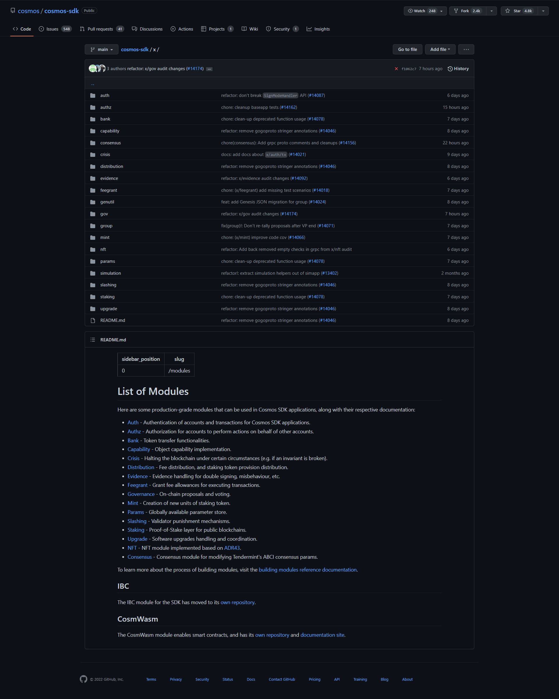

# Modules
Modules are functional components that address application-level concerns such as token management or governance. The Cosmos SDK includes several ready-made modules so that application developers can focus on the truly unique aspects of their application. 

Each Cosmos chain is a purpose-built blockchain. Cosmos SDK modules define the unique properties of each chain. Modules can be considered state machines within the larger state machine. They contain the storage layout, or state, and the state transition functions, which are the message methods. 

Modules define most of the logic of Cosmos SDK applications.

When a transaction is relayed from the underlying Tendermint consensus engine, <code>BaseApp</code> decomposes the <code>Messages</code> contained within the transaction and routes messages to the appropriate module for processing. Interpretation and execution occur when the appropriate module message handler receives the message. 

**Developers compose together modules using the Cosmos SDK to build custom application-specific blockchains.**

### Module scope
Modules include core functionality that every blockchain node needs:
- A boilerplate implementation of the Application Blockchain Interface (ABCI) that communicates with the underlying Tendermint consensus engine.

- A general-purpose data store that persists the module state called <code>multistore</code>.

- A server and interfaces to facilitate interactions with the node.

Modules implement the majority of the application logic **while the core attends to wiring and infrastructure concerns**, and enables modules to be composed into higher-order modules. 

A module defines a subset of the overall state, using:
- One or more keys or value stores, known as <code>KVStore</code>.
- A subset of message types that are needed by the application and do not exist yet.

### Build Custom Modules required by their App
Most of the work for developers involved in building a Cosmos SDK application consists of building custom modules required by their application that do not exist yet, and integrating them with modules that already exist into one coherent application. Existing modules can come either from the Cosmos SDK itself or from third-party developers. You can download these from an online module repository.

### Module components
It is best practice to define a module in the <code>x/moduleName</code> folder. 

 For example, the module called Checkers would go in <code>x/checkers</code>. If you look at the Cosmos SDK's base code, it also defines [its modules](https://github.com/cosmos/cosmos-sdk/tree/main/x) in an <code>x/</code> folder.
  

 

### Module Implementions
Modules implement several elements:

- Interfaces: Interfaces facilitate communication between modules and the composition of multiple modules into coherent applications.

- Protobuf: Protobuf provides one **<code>Msg</code> service to handle messages and one gRPC <code>Query</code> service to handle queries.**

- Keeper: A Keeper is a **controller** that defines the state and presents methods for updating and inspecting the state.

